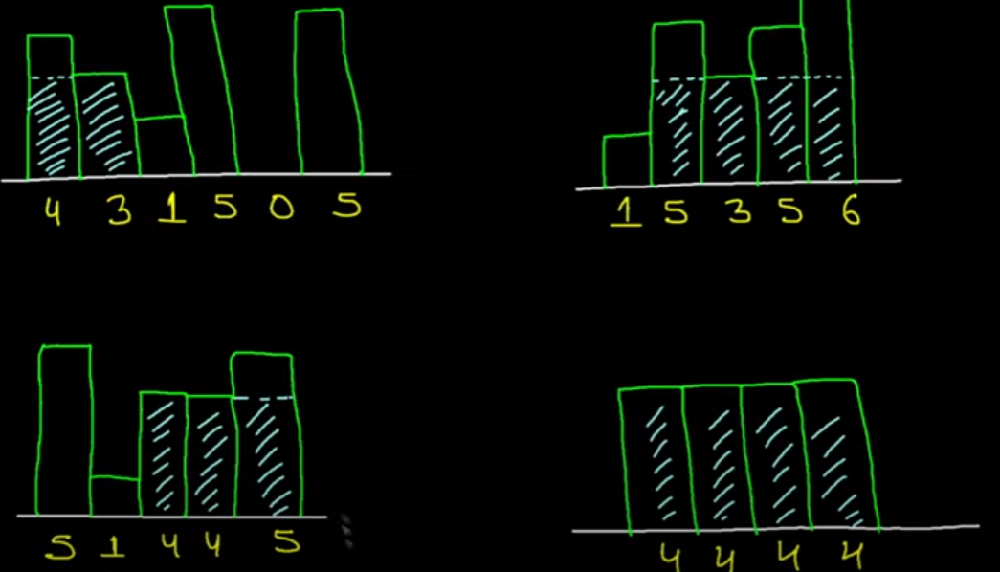

## Largest Rectangle in Histogram ##

 
<br/> 

- Notice that in every largest rectange, there is always a complete rectange used up?
- Brute force: For every complete rectangle, we find its largest rectange. Than compare all the largest rectangles
<br/>

- Notice that for that complete rectangle
	- Left boundary of largest rectange is just **before** we see a rectangle smaller than complete rectangle
	- init an array that will store the 1<sup>st</sup> index of rectange smaller than current rectange (for when we take it as complete rectangle)
	 ```
	for (int idx = 1; idx < height.length; idx++) {              
		int firstIdxOfHeightSmallerThanCurr = idx - 1;
		
		while (firstIdxOfHeightSmallerThanCurr >= 0 && height[firstIdxOfHeightSmallerThanCurr] >= height[idx]) {
			firstIdxOfHeightSmallerThanCurr--;
		}
   		firstIdxOfHeightSmallerFromLeft[idx] = firstIdxOfHeightSmallerThanCurr;              
	}
	``` 
	<br/>
	
	- Right boundary of largest rectange is just **before** we see a rectangle smaller than complete rectangle
	- init an array that will store the 1<sup>st</sup> index of rectange smaller than current rectange (for when we take it as complete rectangle)
	 ```
	for (int idx = height.length-2; idx >= 0; idx--) {              
		int firstIdxOfHeightSmallerThanCurr = idx + 1;
		
		while (firstIdxOfHeightSmallerThanCurr <= height.length-1 && height[firstIdxOfHeightSmallerThanCurr] >= height[idx]) {
			firstIdxOfHeightSmallerThanCurr++;
		}
   		firstIdxOfHeightSmallerThanCurrFromRight[idx] = firstIdxOfHeightSmallerThanCurr;              
	}
	``` 
	<br/>

- Finally, obtain answer with 1 pass
```
int maxArea = 0;
    for (int i = 0; i < height.length; i++) {
        maxArea = Math.max(maxArea, height[i] * 
	(firstIdxOfHeightSmallerThanCurrFromRight[i] - firstIdxOfHeightSmallerThanCurrFromLeft[i] - 1));
    }
```

- To remove the **O(n<sup>2</sup>)** bottleneck (1<sup>st</sup> 2 code blocks)
	<br/>
	
	- We can do faster by reusing **previous calculations** OR **monotonicity**
 ```
	for (int idx = 1; idx < height.length; idx++) {              
		int firstIdxOfHeightSmallerThanCurr = idx - 1;
		
		while (firstIdxOfHeightSmallerThanCurr >= 0 && height[firstIdxOfHeightSmallerThanCurr] >= height[idx]) {
			firstIdxOfHeightSmallerThanCurr = firstIdxOfHeightSmallerFromLeft[firstIdxOfHeightSmallerThanCurr];
		}
   		firstIdxOfHeightSmallerFromLeft[idx] = firstIdxOfHeightSmallerThanCurr;              
	}
``` 
 ```
	for (int idx = height.length-2; idx >= 0; idx--) {              
		int firstIdxOfHeightSmallerThanCurr = idx + 1;
		
		while (firstIdxOfHeightSmallerThanCurr <= height.length-1  && height[firstIdxOfHeightSmallerThanCurr] >= height[idx]) {
			firstIdxOfHeightSmallerThanCurr = firstIdxOfHeightSmallerFromRight[firstIdxOfHeightSmallerThanCurr];
		}
   		firstIdxOfHeightSmallerFromRight[idx] = firstIdxOfHeightSmallerThanCurr;              
	}
``` 
